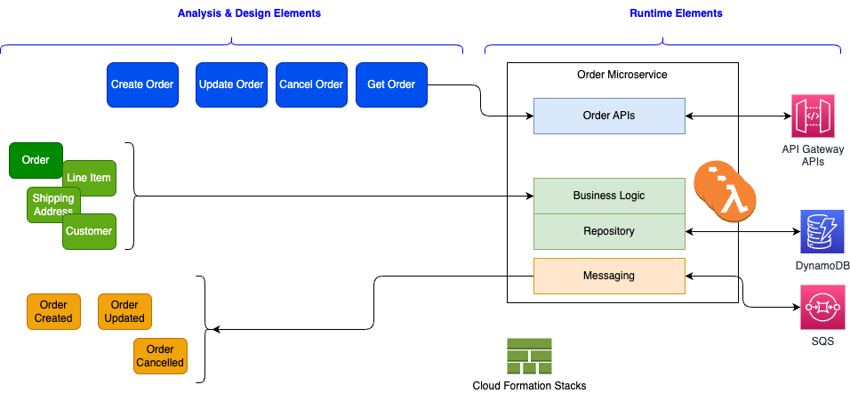

# Architecture

[AWS Lambda](https://docs.aws.amazon.com/lambda/latest/dg/welcome.html) helps you to run code without managing server.


## Microservice and Lambda

The Lambda code fits in the function programming paradigm. This is not a microservice. The entry point is a unique handler function. The payload is call event, but is a loose definition as agreed upon in classical [event-driven architecture](https://jbcodeforce.github.io/eda-studies/eda/), where it represents something happen as immutable fact. In microservice design, developer has to think about domain-driven-design (DDD) bounded context. The methodology starts with the [event storming practice](https://jbcodeforce.github.io/eda-studies/event-storming/) and apply [DDD constructs](https://jbcodeforce.github.io/eda-studies/ddd/) like commands, aggregates, repository... Those elements are the grouping that serve as foundations for the microservice implementation. The following figure illustrates how to move from elements discovered during DDD sessions and a microservice supports the Order Entity:


* The commands are mapped to APIs
* The Entity and value objects will be persisted via a repository
* Events are defined with schema and produce/consumer via a messaging API layer

The common practice to develop microservice is to adopt a test-driven development, which lead to define and tune the API definition bottom-up. The same apply for the business logic, and the event definitions. Which means the API definition and contract should come as an external definition using the OpenAPI standard. The same for the asynchronous communication of the events propagation or consumption, asyncAPI document can be generated from code. In Java world, [Quarkus](https://quarkus.io) and [microprofile](https://microprofile.io/) facilitate the implementation of microservice. Nodejs has the expressjs library to define API and code organization helps to support a single unit deployment. For Python, Flask is a common library to expose REST api.

Those practices lead to have one Git Repository per microservice, with infrastructure as code to build a container and deploy to target runtime (Kubernetes cluster, AWS ECS Fargate). A microservice development ownership is limited to few persons. Microservices do not need to be event-driven on day one. It is important to know and understand the [microservice challenges](https://jbcodeforce.github.io/eda-studies/patterns/#microservice-challenges) and the scalability requirements of the service. When the number of service consumer and the number of requests grow above a certain level, that the service level operations are no more well serve, then refactoring are needed to move to the asynchronous, and horizontal scaling (See why [EDA is an evolution of SOA](https://jbcodeforce.github.io/eda-studies/eda/#why-eda-is-important-in-2020s)).

### Lambda to implement microservice

While Lambda seems to map to microservice principles of separating an application into distinct units of independent deployment, it is still a function programming. There is nothing wrong about that, but the design and granularity of the business logic to fit into this function handler may violate some other software engineering principles, like encapsulation, clear separation of concern, avoid unnecessary complexity. Taking the same DDD elements for the order microservice, we can try to map it into Lambdas and other services to support the same bounded context:



The command definitions are done in Amazon API Gateway elements not in the form of OpenAPI. To support the command implementation in Lambda [there are two choices](https://docs.aws.amazon.com/lambda/latest/operatorguide/monolith.html): 1/ one Lambda per REST resource verbs, or 2/ group in one function handler with routing depending of the HTTP method used. The [AWS Powertool REST API](https://docs.powertools.aws.dev/lambda/python/latest/core/event_handler/api_gateway/) supports the second pattern with annotation. The first solution means duplicate code, and complex infrastructure as code, while the second is more 'microservice' principle oriented, simpler to unit test and to package. The routing logic is boilerplate code with minimum business logic.

```python
def handler(command, context):
    httpMethod = command['httpMethod']
    if httpMethod == 'GET':
        car_id = command['pathParameters']['car_id']
        car = getCar(car_id)
        return car
    elif httpMethod == 'POST':
        carStr=command['body']
        car=json.loads(carStr)
        carOut = createCar(car)
```

The microservice is now a group of lambda, API gateway construct, dynamodb tables (or SQL ones, does not matter for this discussion), and queueing for event propagation. The code integrity is done via the Infrastructure as Code (IaC) definition. This IaC can be done with cloud formation or AWS Serverless Application Model [SAM](https://docs.aws.amazon.com/serverless-application-model/latest/developerguide/what-is-sam.html). 
When adopting and event-driven implementation, we need to assess if we want to use the [Transactional Outbox pattern](https://jbcodeforce.github.io/eda-studies/patterns/#transactional-outbox), by saving the event to a dedicate event table, and use Change Data Capture or DynamoDB streaming to propagate events to the downstream consumers.


### Lambda constructs

A  Lambda function has three primary components – trigger, code, and configuration.

{ width=800 }

* **Triggers** describe when a Lambda function should run. A trigger integrates the Lambda function with other AWS services, enabling to run the Lambda function in response to certain API calls that occur in the AWS account. To support microservice implementation using Lamdba, the main trigger should be API Gateway.
* An **execution environment** manages the processes and resources that are required to run the function. 
* **Configuration** includes compute resources, execution timeout, IAM roles (lambda_basic_execution)...

## Run Time architecture

The execution environment follows the [life cycle](https://docs.aws.amazon.com/lambda/latest/dg/lambda-runtime-environment.html) as defined below (time goes from left to right):

{ width=800 }

* In the **Init phase**, Lambda creates or unfreezes an execution environment with the configured resources, downloads the code for the function and all the needed layers, initializes any extensions, initializes the runtime, and then runs the function’s initialization code. After init, the environment is 'Warm'. The extension and runtime inits is part of the `cold start` (<1s).
* In the **Invoke phase**, Lambda invokes the function handler. After the function runs to completion, Lambda prepares to handle another function invocation.
 * During **Shutdown phase:** Lambda shuts down the runtime, alerts the extensions to let them stop cleanly, and then removes the environment.

???- Info "Lambda Extension"
    Lambda supports external and internal [extensions](https://docs.aws.amazon.com/lambda/latest/dg/lambda-extensions.html). An external extension runs as an independent process in the execution environment and continues to run after the function invocation is fully processed. Can be used for logging, monitoring, integration...

* The Lambda service is split into the control plane and the data plane. The control plane provides the management APIs (for example, `CreateFunction`, `UpdateFunctionCode`). The data plane is where Lambda's API resides to invoke the Lambda functions. It is HA over multi AZs in same region.
* Lambda Workers are bare metal Amazon EC2 Nitro instances which are launched and managed by Lambda in a separate isolated AWS account which is not visible to customers. Each worker has one to many [Firecraker microVMs](https://aws.amazon.com/blogs/aws/firecracker-lightweight-virtualization-for-serverless-computing/). There is no container engine. Container image is just for packaging the lambda code as zip does.

    {width=1000}

    * **Synchronous calls** are used for immediate function response, with potential errors returned to the caller. It may return throttles when the number of requests hits the concurrency limit.
    * **Asynchronous calls** return an acknowledgement message. Event payloads are always queued for processing before invocation. Internal SQS queue persists messages for up to 6 hours. Queued events are retrieved in batches by Lambda’s poller fleet. The poller fleet is a group of Amazon EC2 instances whose purpose is to process queued event invocations which have not yet been processed. When an event fails all processing attempts, it is discarded by Lambda. The dead letter queue (DLQ) feature allows sending unprocessed events from asynchronous invocations to an Amazon SQS queue or an Amazon SNS topic defined by the customer. Asynchronous processing should be more scalable.
    * **Event source** mapping is used to pull messages from different streaming sources and then synchronously calls the Lambda function. It reads using batching and send all the events as argument to the function. If the function returns an error for any of the messages in a batch, Lambda retries the whole batch of messages until processing succeeds or the messages expire. It supports error handling. 
    * If the service is not available. Callers may queue the payload on client-side to retry. If the invoke service receives the payload, the service attempts to identify an available execution environment for the request and passes the payload to that execution environment to complete the invocation. It may lead to create this execution environment.

    { width=800 }


* There is one runtime that matches the programming language (Java, Node.js, C#, Go, or Python. ).
* To reuse code in more than one function, consider creating a Layer and deploying it. A layer is a ZIP archive that contains libraries, a custom runtime, or other dependencies. [See layer management in product documentation]()
* Lambda supports versioning and developer can maintain one or more versions of the lambda function. We can reduce the risk of deploying a new version by configuring the alias to send most of the traffic to the existing version, and only a small percentage of traffic to the new version. Below  is an example of creating one Alias to version 1 and a routing config with Weight at 30% to version 2. Alias enables promoting new lambda function version to production and if we need to rollback a function, we can simply update the alias to point to the desired version. Event source needs to use Alias ARN for invoking the lambda function.

    ```sh
    aws lambda create-alias --name routing-alias --function-name my-function --function-version 1  --routing-config AdditionalVersionWeights={"2"=0.03}
    ```
    
* Each lambda function has a unique ARN.
* Deployment package is a zip or container image.

## Fit for purpose

### Technical constraints

There are a set of physical constraints the Lambda application needs to support:

* Per region deployment.
* Must run under 15 min.
* Memory from 128MB to 10GB.
* Maximum 1000 concurrent calls.
* Code in compressed zip should be under 50MB and 250MB uncompressed.
* Disk capacity for /tmp is limited to 10GB.

### Design constraints

* Event-driven architectures use events to communicate between services and invoke decoupled services.

* When migrating existing application [review the different design patterns to consider](./index.md/#designing-for-serverless).
* Think about co-existence with existing application and how API Gateway can be integrated to direct traffic to new components (Lambda functions) without disrupting existing systems. With [API Gateway](./apigtw.md) developer can export the SDK for the business APIs to make integration easier for other clients, and can use throttling and usage plans to control how different clients can use the API.
* Do cost comparison analysis. For example API Gateway is pay by the requests, while ALB is priced by hours based on the load balance capacity units used per hour. Lambda is also per request based.
* Not everything fits into the function design. Assess if it makes sense to map REST operations in the same handler. AWS [Lambda Powertools](https://docs.powertools.aws.dev/lambda/python/latest/) has a APIGatewayRestResolver that makes the code neat with api being defined with annotation: see [Lambda DynamoDB example](https://github.com/jbcodeforce/yarfba/tree/main/labs/lambdas/lambda-dynamo)
* Assess when to use Fargate when the application is in container, and may run for a long time period. Larger packaging may not be possible to run on Lambda. Applications that use non HTTP end point, integrate to messaging middleware with Java based APIs are better fit for Fargate deployment.


### Lambda and Event-driven architecture

Event-driven architectures use events to communicate between services and invoke decoupled services.

The reference architecture for Event-driven architecture is described in [this article](https://jbcodeforce.github.io/eda-studies/eda/#components-of-the-architecture) with a focus to the ['event backbone' expected capabilities](https://jbcodeforce.github.io/eda-studies/eda/#a-zoom-into-the-event-backbone-capabilities). To simplify, I will claim, a event backbone includes a messaging middleware with persistence, schema management, supporting point to point queue, pub-sub topics, and streaming capabilities.

One important consideration is to address what are the event producers, and then what consumers are interested by those events.

Lambda Function can be producer of business events to an event backbone. It can also be a consumer, and Lambda has native support for events produced by message and streaming services like Amazon Simple Queue Service (SQS), Amazon Simple Notification Service (SNS), and Amazon Kinesis.

## Integration with other services

### APIs

### Event sourcing

### Multi event sources

### Queueing integration


### Streaming integration

## Service limits