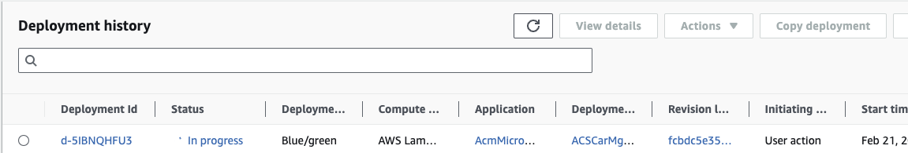
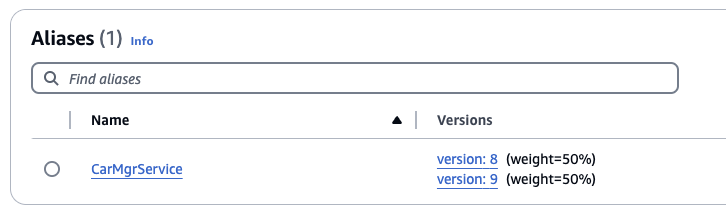

# DevOps

This section addresses development practices and operations for Lambda application. 

As solution deployed on AWS, and integrating with AWS services, developers need to study the [SDK (e.g. Python boto3 module)](https://boto3.amazonaws.com/v1/documentation/api/latest/index.html).

There are a lot of source of information, starting by [aws.amazon.com/devops/](https://aws.amazon.com/devops/).

## Development tooling

There is no need to be prescriptive in this domain as each developer has his/he own habit. However as the solution will run on AWS cloud there are a lot of nice tools and open source content developers should consider.

The core element of the infrastructure as code (IaC) on AWS is [AWS CloudFormation](https://aws.amazon.com/cloudformation). If developers or DevOps engineers prefer to use programming language to define service configuration and code deployment the [AWS Cloud Development Kit](https://docs.aws.amazon.com/cdk/v2/guide/getting_started.html) is a powerful solution. It uses code which can be integrated in the same Git repository as application / microservice code.

Below is an example of repository structure, with separate folder for IaC code (here based on AWS CDK), integration tests under `e2` folder, `src` for lambda code, and unit `tests` folders.

```sh
autonomous_car_mgr
├── IaC
│   ├── README.md
│   ├── acm
│   │   ├── __init__.py
│   │   └── main_stack.py
│   ├── app.py
│   ├── cdk.json
│   ├── requirements-dev.txt
│   ├── requirements.txt
│   ├── source.bat
│   └── tests
├── e2e
│   ├── CreateCarRecords.py
│   ├── CreateNewCarViaAPI.py
│   ├── GetCarById.py
├── src
│   ├── carmgr
│   │   ├── __init__.py
│   │   ├── acm_model.py
│   │   └── app.py
│   └── requirements.txt
└── tests
    ├── requirements-dev.txt
    └── ut
```

### CDK

CDK uses an imperative programming style which can make complex logic and conditionals easier to implement compared to the declarative style of AWS SAM templates.

See an example of CDK application to deploy API Gateway, Lambda function implementing a simple microservice, and DynamoDB table [here.](https://github.com/jbcodeforce/autonomous-car-mgr/blob/main/cdk/acm/main_stack.py). 

See [AWS CDK Python Reference](https://docs.aws.amazon.com/cdk/api/v2/python/) to get examples and API description to create anything in AWS.

As a pre-requisite developers need to bootstrap CDK in the target deployment region using `cdk bootstrap`. 

CDK code can be validated using

```sh
cdk synth
```
which creates a CloudFormation template in cdk.out folder.

Then any code or IaC updates can be deployed using:

```sh
cdk deploy
```

### [AWS SAM - Serverless Application Model](https://docs.aws.amazon.com/serverless-application-model/latest/developerguide/what-is-sam.html)

AWS SAM is an extension of AWS CloudFormation with a simpler syntax for configuring common serverless application resources such as functions, triggers, databases and APIs. It offers the following benefits:

* Define the application infrastructure as code quickly, using less code.
* Manage the serverless applications through their entire development lifecycle.
* Quickly provision permissions between resources with AWS SAM connectors.
* SAM CLI provides a Lambda-like execution environment that lets you locally build, test, and debug applications defined by SAM templates or through the AWS Cloud Development Kit (CDK).
* Continuously sync local changes to the cloud as we develop.
* On top of CloudFormation or Terraform.


SAM includes two parts:

1. SAM template specification: It is an extension on top of AWS CloudFormation.
1. A CLI to create new project, build and deploy, perform local debugging and testing, configure pipeline.

During deployment, SAM transforms and expands the SAM syntax into AWS CloudFormation syntax.

See [SAM templates here](https://github.com/aws/aws-sam-cli-app-templates)


* See the [Getting started tutorial.](https://docs.aws.amazon.com/serverless-application-model/latest/developerguide/serverless-getting-started-hello-world.html)
* [A Complete SAM Workshop.](https://catalog.workshops.aws/complete-aws-sam/en-US)
and the [creating your first API from scratch with OpenAPI and AWS SAM](https://catalog.us-east-1.prod.workshops.aws/workshops/4ff2d034-dee1-4570-93d9-11a54cc5d60c/en-US).

SAM CLI supports local development and testing of Lambda apps. To run AWS SAM projects locally, you need to have Docker installed and running on your local machine. it will create a local HTTP server hosting all of template's functions (need to specify the DOCKER_HOST env variable if not, you may get `Error: Running AWS SAM projects locally requires Docker. Have you got it installed and running?`). 

```sh
DOCKER_HOST=unix:///$HOME/.docker/run/docker.sock sam local start-api
```

SAM CLI can also being [combined with the template CDK created](https://docs.aws.amazon.com/serverless-application-model/latest/developerguide/serverless-cdk-getting-started.html): basically the CDK defines the lambda functions and other resources, while SAM invoke the function from the definition within the template.

```sh
cdk synth
# it will create a cloud formation template under cdk.out folder
DOCKER_HOST=unix:///$HOME/.docker/run/docker.sock sam local function_name -t  cdk.out/ACSCarMgr.template.json
```

Now if the Lambda function has dependencies it is recommended to do a sam build using the template from CDK and then invokes from the created content. The build will look at the requirements.txt for the function and build every assets in the folder `.aws-sam/build` folder:

```sh
sam build -t cdk.out/TmpStack.template.json
DOCKER_HOST=unix:///$HOME/.docker/run/docker.sock sam local invoke MyFunction --no-event
```

When testing a request coming from API Gateway we can use an event.json payload 

```sh
DOCKER_HOST=unix:///$HOME/.docker/run/docker.sock sam local invoke MyFunction -e events/getcars.json
```

Also CDK provides a full-featured local development environment with watch mode, so updating deployed Lambda function from local update.

```dh
cdk watch
```


## Code boilerplate

[AWS Powertools](https://docs.powertools.aws.dev/lambda/python/) has a REST resolver to annotate function to support different REST resource paths and HTTP verbs. It leads to cleaner code, and easier to test the business logic: each path and HTTP method is implemented by different function:

```python
@app.get("/cars/<car_id>")
@tracer.capture_method
def getCarUsingCarId(car_id: str):
    car = car_table.get_item( Key={'car_id': car_id})
    logger.debug(car)
    return car['Item']
```

[See the app.py code](https://github.com/jbcodeforce/autonomous-car-mgr/blob/main/src/carmgr/app.py) and how to unit test it using pytest [test_acr_mgr.py](https://github.com/jbcodeforce/autonomous-car-mgr/blob/main/tests/ut/test_acr_mgr.py).

When using Powertools REST resolver, the API Gateway API needs to be a proxy integration to Lambda as the REST resolver will use the metadata of the request.

```python
def handler(message: dict, context: LambdaContext) -> dict:
    return app.resolve(message, context)
```

The Powertools library is integrated as a Lambda layer.

### Layers for reuse

Layers are packages of libraries or other dependencies that can be used by multiple functions.

A layer is a ZIP archive that contains libraries, a custom runtime, or other dependencies. [See lambda layer management in product documentation](https://docs.aws.amazon.com/lambda/latest/dg/chapter-layers.html).

One of the advantage is to see the function code in the Lambda console.

When you add a layer to a function, Lambda loads the layer content into the /opt directory of that execution environment. 

Example of packaging python dependencies as zip, and create a Lambda Layer to be reused. 

```sh
pip3 install --target ./package -r requirements.txt
cd package
zip -r ../pck.zip .
# use CLI for example 
aws lambda publish-layer-version --layer-name common-python3 \
    --description "A layer for some python lambda" \
    --license-info "MIT" \
    --zip-file fileb://pck.zip \
    --compatible-runtimes python3.10 python3.11 \
    --compatible-architectures "arm64" "x86_64"
```

### Deeper dive

* [Getting started with Powertools](https://docs.powertools.aws.dev/lambda/python/latest/)
* [How to use layer to manage common dependencies in Lambda.](https://docs.aws.amazon.com/lambda/latest/dg/chapter-layers.html#lambda-layers-overview)

### Unit testing

The unittest can be done using mock library to bypass remote calls. Tests may be defined using pytest library and commands.

For example the folder: [tests/ut](https://github.com/jbcodeforce/autonomous-car-mgr/tree/main/tests/ut) includes test case definitions to test the microservice. 

```sh
pytest -vs
```

* Example of test mock for a dynamodb client, using [moto library](https://docs.getmoto.org/en/latest/)

```python
from moto import mock_aws

@pytest.fixture(scope="module")
def dynamodb_client(aws_credentials):
    """DynamoDB mock client."""
    with mock_aws():
        conn = boto3.client("dynamodb", region_name="us-west-2")
        yield conn
```

* With injection to tune the app under test

```python
@pytest.fixture(scope="module")
def getApp(dynamodb_client,populate_table,event_client,secret_client):
```

See the full code in [test_acr_mgr.py](https://github.com/jbcodeforce/autonomous-car-mgr/blob/main/tests/ut/test_acr_mgr.py).

### Deployment

Package the code as ZIP file (250MB limit) or container image (with 10GB limit).

Lambda can use Layer to simplify code management and reuse. The Powertools library for example can be used as a layer.

```python
powertools_layer = aws_lambda.LayerVersion.from_layer_version_arn(
            self,
            id="lambda-powertools",
            layer_version_arn=f"arn:aws:lambda:{env.region}:017000801446:layer:AWSLambdaPowertoolsPythonV2:61"
        )

# referenced in the function definition
 acm_lambda = aws_lambda.Function(self, 'CarMgrService',
     ...
    layers=[powertools_layer],
```

But local dependencies can also being deployed as a zip (See [the product documentation- Working with .zip file archives for Python](https://docs.aws.amazon.com/lambda/latest/dg/python-package.html#python-package-create-dependencies)) for the explanations on how to do it. With CDK it is possible to use the concept of [bundling options](https://docs.aws.amazon.com/cdk/api/v2/python/aws_cdk/BundlingOptions.html#bundlingoptions):

```python
 code= aws_lambda.Code.from_asset(path="../src/",
        bundling=BundlingOptions(
            image= aws_lambda.Runtime.PYTHON_3_11.bundling_image,
            command= [
                'bash','-c','pip install -r requirements.txt -t /asset-output && cp -rau . /asset-output'
            ],
    )),
```

In case of import error on Lambda execution, ask Amazon Q and [re:Post](https://repost.aws/knowledge-center/lambda-import-module-error-python), some library bundled on Mac will not work on other Lambda runtime.

### Integration tests

Once the solution is deployed we can test by using the API Gateway API endpoints. The tests can be defined using Python script files (under [e2e folder](https://github.com/jbcodeforce/autonomous-car-mgr/tree/main/e2e)).

```sh
python GetCarByIdUsingAPI.py 2
```

## Error Handling by execution model

As a general practice, implement error handling within each function rather than propagating errors up the call chain. This prevents failures in one function from impacting others.

Implement throttling, retries and DLQs between functions to avoid failures in one function causing cascading failures in others.

There are different ways to support error handling, depending of the integration and communication protocol.

???+ "API Gateway - synchronous call"
    * **Timeout** – API Gateway has a 30-second timeout. If the Lambda function hasn't responded to the request within 30 seconds, an error is returned to the client caller.
    * **Retries** – There are no built-in retries if a function fails to execute.
    * **Error handling** – Generate the SDK from the API stage, and use the backoff and retry mechanisms it provides.

???+ "SNS - asynch"
    * **Timeout** – Asynchronous event sources do not wait for a response from the function's execution. Requests are handed off to Lambda, where they are queued and processed by Lambda.
    * **Retries** – Asynchronous event sources have built-in retries. If a failure is returned from a function's execution, Lambda Service will attempt that invocation two more times for a total of three attempts to execute the function with its event payload. We can use the Retry Attempts configuration to set the retries to 0 or 1 instead. If Lambda is unable to invoke the function (for example, if there is not enough concurrency available and requests are getting throttled), Lambda will continue to try to run the function again for up to 6 hours by default. We can modify this duration with Maximum Event Age.
    * **Error handling** - Use the Lambda destinations OnFailure option to send failures to another destination for processing. Alternatively, move failed messages to a dead-letter queue on the function.

???+ "Kinesis Data Streams"
    * **Timeout** – When the retention period for a record expires, the record is no longer available to any consumer (24h). As an event source for Lambda, we can configure `Maximum Record Age` to tell Lambda to skip processing a data record.
    * **Retries** –  By default, Lambda retries a failing batch until the retention period for a record expires. We can configure `Maximum Retry Attempts` so that the Lambda function will skip retrying a batch of records.
    * **Error handling** - Configure an OnFailure destination on the Lambda function so that when a data record reaches the `Maximum Retry Attempts` or `Maximum Record Age`, we can send its metadata, such as shard ID and stream Amazon Resource Name (ARN), to an SQS queue or SNS topic.

???+ "SQS Queue"
    * **Timeout** – When the visibility timeout expires, messages become visible to other consumers on the queue. Set our visibility timeout to 6 times the timeout we configure for our function.
    * **Retries** – Use the `maxReceiveCount` on the queue's policy to limit the number of times Lambda will retry to process a failed execution.
    * **Error handling** - Write our functions to delete each message as it is successfully processed. Move failed messages to a dead-letter queue configured on the source SQS queue.

???+ Dead-letter queues
    We may turn on dead-letter queues and create dedicated dead-letter queue resources using Amazon SNS or Amazon SQS for individual Lambda functions that are invoked by asynchronous event source.

## Monitoring

### CloudWatch monitoring

[Lambda monitoring](https://docs.aws.amazon.com/lambda/latest/dg/monitoring-functions-access-metrics.html) is supported by Amazon CloudWatch, with logs and metrics such as invocation count, duration, and errors. Within CloudWatch, DevOps team may set alarms on certain metrics that may breach, to create notifications to the team.

Logs need to be added to the Function code. (print() in Python goes to the log). Use boilerplate code like AWS Powertools to control the logging level, participate in Xray reporting to view detailed traces of requests across your application and Lambda functions. This helps pinpoint where latency is occurring.

### Using AWS Powertools

[AWS Powertools](https://docs.powertools.aws.dev/lambda/python/latest/) includes methods and libraries for quickly implementing consistent logging, metrics, and traces inside your codebase.

Use X-Ray to understand end to end event flow, cross components of your solution.

### Asynchronous processing

While messages go to dead letter queues to handle errors and monitor messages sent to the DLQ. This helps track failed invocations.

## CI/CD pipeline

We recommend to follow [this workshop - Building CI/CD pipelines for Lambda canary deployments using AWS CDK](https://catalog.us-east-1.prod.workshops.aws/workshops/5195ab7c-5ded-4ee2-a1c5-775300717f42/en-US) as a good source on how to do blue/green deployment.

The autonomous car manager service use the concepts of this workshop, like alias, function versioning, CodeDeploy application.

### Version management - Rollback

Lambda supports versioning and developer can maintain one or more versions of the lambda function. We can reduce the risk of deploying a new version by configuring the `alias` to send most of the traffic to the existing version, and only a small percentage of traffic to the new version. Below  is an example of creating one Alias to version 1 and a routing config with Weight at 30% to version 2. Alias enables promoting new lambda function version to production and if we need to rollback a function, we can simply update the alias to point to the desired version. Event source needs to use Alias ARN for invoking the lambda function.

```sh
aws lambda create-alias --name routing-alias --function-name my-function --function-version 1  --routing-config AdditionalVersionWeights={"2"=0.03}
```

### Blue/Green

### Canary deployment

Canary deployment works similarly to blue-green deployment but use a small set of servers before finishing the others. With Lambda to achieve canary deployments we need to use [AWS CodeDeploy](https://us-west-2.console.aws.amazon.com/codesuite/codedeploy/start?region=us-west-2).

CodeDeploy application is the Lambda version. To enable traffic shifting deployments for Lambda functions, CodeDeploy uses Lambda Aliases, which can balance incoming traffic between two different versions of your function. When you publish a new version of the function to your stack, CodeDeploy will send a small percentage of traffic to the new version, monitor, and validate before shifting 100% of traffic to the new version.

Below is an example of creating a CodeDeploy application and deployment group to use the last created alias version:

```python
def code_deploy_app(self,fctAlias):
        application=  aws_codedeploy.LambdaApplication(self, "AcmCodeDeploy",
            application_name="AcmMicroservice"
        )
        deployment_group = aws_codedeploy.LambdaDeploymentGroup(self, "AcmBlueGreenDeployment",
            application=application,  # optional property: one will be created for you if not provided
            alias=fctAlias,
            deployment_config=aws_codedeploy.LambdaDeploymentConfig.LINEAR_10_PERCENT_EVERY_1_MINUTE
        )
        return application
```

When the CloudFormation has created the CodeDeploy application, we can see the deployment of the Lambda occurring



And Lambda having 2 versions with different traffic ratio:




## Other tools

### Cloud9

[Cloud9 IDE](https://docs.aws.amazon.com/cloud9/latest/user-guide/ide.html) is a nice solution to get a vscode compatible IDE on linux, so Lambda code can be compatible with runtime.

Some quick installation updates

* update python, under environment

```sh
python3 --version
>> 
wget https://www.python.org/ftp/python/3.11.8/Python-3.11.8.tgz               
tar xzf Python-3.11.8.tgz 

sudo ./configure --enable-optimizations 
sudo make altinstall 
# The Python binary will be available under the /usr/local/bin directory.
python3.11 --version
```

To work on the autonomous-car-mgr, git clone the repository. 

Then for:

* Start a Python virtual env

    ```sh
    python3.11 -m venv .devenv
    source .devenv/bin/activate
    ```

* Package with the Python libraries dependencies for Linux

    ```sh
    # Under src
    pip install  -r requirements.txt -t package
    cd package
    zip -r ../package.zip .
    cd .. && rm -r package
    ```

* CDK deployment, be sure to install cdk in a Python 11 virtual env:

    ```sh
    python3.11 -m venv .devenv
    source .devenv/bin/activate
    # under cdk
    pip install -r requirements.txt
    # Verify 
    cdk lynch
    # Do a stack update
    cdk deploy
    ```

* 