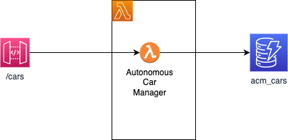

# Lambda studies

???- Info "Version"
    Created 01/2024. Update 02/2024

This repository includes a set of best practices around developing a solution using Lambda and Amazon serverless services. To demonstrate some of the concepts with code, the repository also includes a simple microservice to manage an inventory of Autonomous Robot Cars.

## Questions this repository try to answer

### Architecture Patterns

* [x] Review Lambda runtime architecture (internal view). [See this section >>> ](./architecture.md/#lambda-run-time-architecture)
* [x] Serverless architecture patterns: how to map to a microservice approach ? what are the best practices for using Lambda functions to ensure loose coupling and service autonomy? 
* [x] How to use event sourcing with Lambda? 
* [ ] How to handle state management in a stateless environment like AWS Lambda, especially for complex workflows or transactions?
* [x] What are the best practices for integrating AWS Lambda with other AWS services, particularly for event-driven architectures?
* [x] How to design Lambda functions to handle events from multiple sources, and what considerations are there for managing event source mappings?
* [x] How do AWS Lambda's service limits impact architectural decisions, and what strategies can be used to mitigate potential limitations? [Answer>>>](./architecture.md/#service-limit-or-quotas)
* [x] Are there specific scenarios where AWS Lambda might not be the best choice, and what alternatives to consider?
* [x] How to integrate API Gateway with Lambda functions to scale demand? 
* [ ] How to use AWS Step Functions to orchestrate multiple Lambda functions for complex workflows?
* [ ] What are the best practices for using event source mappings with Lambda to process records from streams or queues?

[>>> See discussions in architecture section](./architecture.md)

### Scaling

* [ ] How to scale lambda for high-traffic applications and how to monitor scaling?
* [x] How to optimize Lambda function for performance?
* [x] Review strategy to minimize cold start?
* [x] Optimizing for high-throughput?
* [x] How does the allocated memory size affect the execution time and cost of Lambda functions?
* [x] How to balance performance / cost?

[>>> See discussions in scaling section](./scaling.md)

### Security

* [X] What are the best practices to secure Lambda functions, especially in terms of managing permissions and access controls? [A >>>](./security.md
* [X] How should sensitive data be managed within Lambda environments?
* [X] How to manage secrets? [A >>>](./security.md/#secrets-in-aws-secrets)
* [X] How to manage IAM roles and permissions for Lambda functions to ensure principle of least privilege?
* [X] How to support encrypting sensitive data processed by Lambda functions, both in transit and at rest?

[>>> See discussions in security section](./security.md)

### Cost Optimization

* [ ] How to optimize AWS Lambda costs for a large-scale application, and what tools or metrics are most useful for monitoring and controlling Lambda expenses?
* [ ] Are there specific patterns or architectural choices that significantly affect cost, and what are the considerations to balance cost with performance?
* [ ] How does AWS Lambda's pricing model scale beyond the free tier, and what measures can be taken to predict and control expenditure?

[>>> See discussions in cost section](./cost.md)

### Development, Operation and CI/CD

* [ ] What are the best practices for deploying Lambda functions in a CI/CD pipeline, and how to manage version control and rollbacks?
* [x] How to support blue-green deployments or canary releases with AWS Lambda? [A >>>](./dev_ops.md/#bluegreen)
* [x] How should error handling be implemented in AWS Lambda to ensure reliability and fault tolerance?
* [x] What to monitor and logging tools or practices do you recommend for AWS Lambda functions to ensure proactive issue resolution?
* [x] What tools to do local development and testing of AWS Lambda functions?
* [ ] How can teams effectively debug Lambda functions, particularly when integrated with other AWS services?
* [ ] How to adopt CI/CD practices for Lambda functions? How to automate deployment while ensuring rollback capabilities for stability?
* [x] How to effectively use versioning and aliases in AWS Lambda to manage deployments and facilitate A/B testing?
* [x] How to implement anomaly detection in Lambda executions to quickly identify and respond to unusual patterns or errors?

[>>> See discussions in development and operations section](./dev_ops.md)

## A demonstration application

To support the discussions addressed in this repository, I will start by a simple application using API Gateway, Lambda, DynamoDB and add some logging and monitoring features on top of it.

The application starts with the simplest deployment as illustrated in the following diagrams:

To be more event-driven microservice, I add event-bridge as middleware to produce messages to.

### Features to consider

* [x] Use PowerTools APIGatewayResolver to use same lambda for CRU on car entity. With unit tests.
* [x] Deploy the app with CDK and API Gateway lambda proxy integration. 
* [ ] Add SQS after API Gateway and get Lambda pulling the messages. Add DLQ