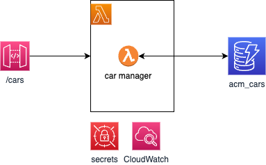

# Autonomous Car Manager Service

A simple application to manage an inventory of Autonomous Robot Cars. This is to demonstrate some of the microservice implementation in Lambda with functional and stress testing.

## Questions this repository try to answer

### Architecture Patterns

* Runtime architecture
* Serverless architecture patterns: how to map to microservice ? 
* How to use event sourcing with Lambda? 
* How do you handle state management in a stateless environment like AWS Lambda, especially for complex workflows or transactions?
* What are the best practices for integrating AWS Lambda with other AWS services, particularly for event-driven architectures?
* How do you design Lambda functions to handle events from multiple sources, and what considerations are there for managing event source mappings?
* How do AWS Lambda's service limits impact architectural decisions, and what strategies can be used to mitigate potential limitations?
* Are there specific scenarios where AWS Lambda might not be the best choice, and what alternatives do you recommend?
* API Gateway Integration: "How should we structure the integration between Lambda functions and API Gateway for efficient request handling and scalability?"
* Microservices Architecture: "In a microservices architecture, what are the best practices for using Lambda functions to ensure loose coupling and service autonomy?"
* Step Functions Integration: "How can AWS Step Functions be utilized to orchestrate multiple Lambda functions for complex workflows?"
* Event Source Mapping: "What are the best practices for using event source mappings with Lambda to process records from streams or queues?"

### Scaling

* How to scale lambda or high-traffic applications and monitor scaling?
* How to optimize Lambda function for performance?
* Review strategy to minimize cold start?
* Optimizing for high-throughput?
* How does the allocated memory size affect the execution time and cost of Lambda functions?
* How to balance performance / cost?

### Security

* What are the best practices for securing Lambda functions, especially in terms of managing permissions and access controls?
* How should sensitive data be managed within Lambda environments?
* How to manage secrets?
* How to manage IAM roles and permissions for Lambda functions to ensure principle of least privilege?
* How to support encrypting sensitive data processed by Lambda functions, both in transit and at rest?

### Cost Optimization

* How to optimize AWS Lambda costs for a large-scale application, and what tools or metrics are most useful for monitoring and controlling Lambda expenses?
* Are there specific patterns or architectural choices that significantly affect cost, and how do you recommend balancing cost with performance?
*  Cost Optimization: "What strategies can we employ to monitor and optimize AWS Lambda costs, particularly in relation to execution time and memory usage?"
* Free Tier and Scaling: "How does AWS Lambda's pricing model scale beyond the free tier, and what measures can we take to predict and control expenditure?"

### Development, Operation and CI/CD

* What are the best practices for deploying Lambda functions in a CI/CD pipeline, and how do you manage version control and rollbacks?
* Can you recommend strategies or tools for blue-green deployments or canary releases with AWS Lambda?
* How should error handling be implemented in AWS Lambda to ensure reliability and fault tolerance?
* What monitoring and logging tools or practices do you recommend for AWS Lambda functions to ensure proactive issue resolution?
* What tools and practices do you recommend for local development and testing of AWS Lambda functions?
* How can teams effectively debug Lambda functions, particularly when integrated with other AWS services?
* CI/CD for Lambda: "Can you discuss CI/CD practices for Lambda functions? How do we automate deployment while ensuring rollback capabilities for stability?"
* Versioning and Aliases: "How do we effectively use versioning and aliases in AWS Lambda to manage deployments and facilitate A/B testing?
* Enhanced Monitoring: "Beyond CloudWatch, are there any third-party tools or AWS services that provide deeper insights into Lambda function performance and health?"
* Anomaly Detection: "How can we implement anomaly detection in Lambda executions to quickly identify and respond to unusual patterns or errors?"

### Future Trends and Updates

* How do you stay informed about best practices and changes in serverless computing, and what resources do you recommend?

## A benchmark application

To support the discussions addressed in this repository, I will use a simple application using API Gateway, Lambda, DynamoDB and adds feature on top of it.

The application starts with the simplest deployment as illustrated in the following diagrams:

