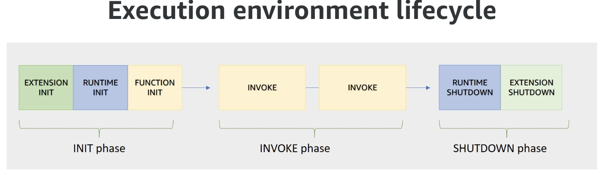
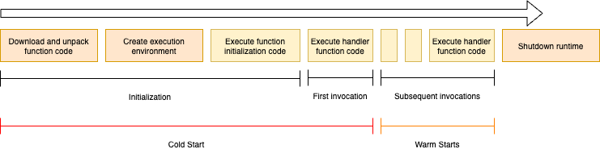

# Scaling

When looking at application scaling it is important to do end to end performance testing, and review each capabilities and service limits of the services the application integrate with. Considering assessing timeouts, retry behaviors, throughput, and payload size.

## Performance considerations

Lambda invokes the code in a secure and isolated execution environment, which needs to be initialized and then executes the function code for the unique request it handles. 

{ width=800 }

Second request will not have the initialization step. When requests arrive, Lambda reuses available execution environments, and creates new ones if necessary. The number of execution environments determines the concurrency. Limited to 1000 by default. This is a soft limit that could be increased.

Concurrency (# of in-flight requests the function is currently handling) is subject to quotas at the AWS Account and Region level.

With API Gateway, there are configuration options for each API, that may help to improve access: like with using Lambda Edge-optimized endpoint, using CloudFront distribution, or use distributed cache to avoid reaching backend.

Here are some good questions to address during design time:

* Who will be using each API?
* Where will they be accessing it from, and how frequently?
* What are the downstream systems that could impact performance?
* Do you need to throttle requests at the "front door" to prevent overloading a downstream component?

When the number of requests decreases, Lambda stops unused execution environments to free up scaling capacity for other functions.

Use the Lambda CloudWatch metric named `ConcurrentExecutions` to view concurrent invocations for all or individual functions.

To estimate **concurrent requests** use:  **Request per second x Avg duration in seconds = concurrent requests**.

The diagram below illustrates the major concepts to understand this concurrency limit: At time T1, the lambda processes 3 requests and performs the init phase for 3 execution environments (it could goes to 1000). After the init, new requests can be processed, but new requests on top of the 3, will create new runtime environment with an init phase. At T3, we are on steady state at 5 concurrent requests. Each request taking 30s, we can see that, once reaching the (burst) quotas, requests can wait 30s to get processed. 

Lambda scales to very high limits, but not all account's concurrency quota is available immediately, so requests could be throttled for a few minutes in case of burst. The concurrency limit is cross Lambda functions within one account and one region.

Obviously most of the lambda processing is done under a second, event few milliseconds, so the scaling numbers are higher that the diagram above. 

There are two scaling quotas to consider with concurrency. Account concurrency quota (1000 per region) and burst concurrency quota (from 500 to 3000 per min per region). Further requests are throttled, and lambda returns HTTP 429 (too many requests).

It is possible to use [**Reserved concurrency**](https://docs.aws.amazon.com/lambda/latest/dg/configuration-concurrency.html), which splits the pool of available concurrency into subsets. A function with reserved concurrency only uses concurrency from its dedicated pool. This is helpful to avoid one lambda function to take all the concurrency quota and impact other functions in the same region. No extra charges.

For functions that take a long time to initialize, or that require extremely low latency for all invocations, **provisioned concurrency** enables to pre-initialize instances of the function and keep them running at all times.

Use `concurrency limit` to guarantee concurrency availability for a function, or to avoid overwhelming a downstream resource that the function is interacting with.

Monitor metrics like invocation duration and throttle count to identify any bottlenecks.

If the test results uncover situations where functions from different applications or different environments are competing with each other for concurrency, developers probably need to rethink the AWS account segregation strategy and consider moving to a multi-account strategy.

## Performance optimization

Some recommendations:

* CPU capacity is allocated proportionally to the amount of allocated memory.

While zooming into the cold start phase,

* We can see that reducing code size and reduce=ing dependencies to the necessary by removing unnecessary files, compressing assets, and optimizing dependencies will help reduce time to start. Smaller packages initialize faster. To better packaging use tools like Maven, Gradle, WebPack, esbuild.  
* Use code outside of the function handler to initialize connections to back end.
* Only import what is necessary for your function to run. Each additional import adds to initialization time.
* Reduce the time to create new environment by using provisioned concurrency: 
* Use [AWS Powertools](https://github.com/aws-powertools/) to add observability to get measures and identify cold start. It can reports to AWS X-Ray.
* Consider worse and best cold start timings to assess where are current limits. Same for worse and best warm start.
* When integrating with RDS, try to adopt RDS proxy to cache read queries, but also brings connection pooling, keeping connection secrets.
* Move expensive startup tasks like loading large datasets or models to a separate "initialization" function. Cache the results and reuse them across invocations instead of reloading on each cold start.
* ElasticCache for Redis, can be used to keep some of the read/only response to avoid reaching a slow backend each time a client application is asking those kind of stable data. One of the benefit is that Caches are shared between runtime environment.
* Consider also closer to client application, caching approaches using API Gateway cache or CloudFront.
* Move to Graviton hardware, if code supports ARM architecture.
* Consider using Python's multiprocessing library to parallelize startup tasks like model loading to improve cold start performance.
* When accessing parameter store from AWS Systems Manager (Using Parameter Store parameters in AWS Lambda functions).
* Consider using provisioned concurrency for critical functions to avoid cold starts altogether for a pool of pre-initialized functions.

### Memory

Memory is the only setting that can impact performance. Both CPU and I/O scale linearly with memory configuration. CPU-bound functions often see improved performance and reduced duration by allocating more memory. We can allocate up to 10 GB of memory to a Lambda function. In case of low performance, start by adding memory to the lambda.

Consider using, [Lambda Power Tuning](https://github.com/alexcasalboni/aws-lambda-power-tuning),  an open source tool that tests a Lambda function with different memory size, returning the average response time for every memory size tested (it includes cold and warm starts).

### Different Hardware

The move from x86 to Graviton 2 (ARM architecture) may improve performance at a lower cost.

## SQS and Lambda

When Amazon SQS is used as a Lambda event source, the Lambda service manages polling the queue. We can set the batch size, concurrency limit, and timeout. Lambda defaults to using five parallel processes to get messages off a queue. If the Lambda service detects an increase in queue size, it will automatically increase how many batches it gets from the queue, each time. The maximum concurrency is 1000.

SQS will continue to try a failed message up to the maximum receive count specified in the re-drive policy, at which point, if a **dead-letter queue** is configured, the failed message will be put into the dead-letter queue and deleted from your SQS queue.

If the visibility timeout expires, before your Lambda function has processed the messages in that batch, any message in that batch that hasn’t been deleted by your function will become visible again. This may generate duplicate processing on the same message. The best practice, is to set your visibility timeout to six times the function timeout.

## Load testing

Perform load testing, close to the business process flow within the different component, to assess which quotas may need some tuning.

The potential tools to support load testing are:

* [Apache JMeter](https://jmeter.apache.org/)
* [Artillery Community Edition](https://www.artillery.io/)
* [Gatling](https://gatling.io/)

## Interesting source of information

* [AWS Lambda Power Tuning tool to find the right memory configuration](https://github.com/alexcasalboni/aws-lambda-power-tuning).
* [Understanding AWS Lambda scaling and throughput - an AWS blog](https://aws.amazon.com/blogs/compute/understanding-aws-lambda-scaling-and-throughput/).
* [How to improve Lambda Warm Start Speed by 95%!](https://community.aws/posts/improved-lambda-warm-start-speed-95)
* [Interesting github for lambda optimization](https://github.com/aws-samples/optimizations-for-lambda-functions).
* [Lambda Power Tuning](https://github.com/alexcasalboni/aws-lambda-power-tuning).
* [How do memory and computing power affect AWS Lambda cost?](https://repost.aws/knowledge-center/lambda-memory-compute-cost)
* [AWS re:Invent 2022 - A closer look at AWS Lambda (SVS404-R)](https://www.youtube.com/watch?v=0_jfH6qijVY)
* [Load testing with Artillery](https://www.artillery.io/)
* [Serverless Snippets Collection - CloudWatch Logs Insights.](https://serverlessland.com/snippets?type=CloudWatch+Logs+Insights)
* [Blog - We Improved Our Lambda Warm Start Speed by 95%! Here’s How.](https://community.aws/posts/improved-lambda-warm-start-speed-95) with [git repository](https://github.com/aws-samples/optimizations-for-lambda-functions)