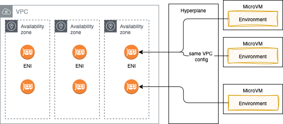

# Security in Lambda context

As a managed service, AWS manages the underlying infrastructure and foundation services, the operating system, and the application platform. Developers need to ensure code, libraries, configuration, IAM are well set.

## Shared responsibility

With the AWS Cloud, managing security and compliance is a [shared responsibility](https://aws.amazon.com/compliance/shared-responsibility-model/) between AWS and the customer:

* [AWS is responsible of security **of** the cloud](https://aws.amazon.com/security/) and offers the most flexible and secure cloud computing environment available today. AWS is responsible for patching their managed services and infrastructure security.
* Customers are responsible for the security **in** the cloud: secure workloads and applications that are deployed onto the cloud. When using EC2, we are responsible to patch OS for security (but AWS helps by providing patched AMIs, or tools such as [Systems Manager](https://aws.amazon.com/systems-manager), or [Inspector](https://aws.amazon.com/inspector/) for continuous vulnerability testing).

## The different security actors in Lambda context

1. A developer who need to access Lambda Management Console, deploy code, review logs. The AWS account IAM administrator needs to authorize access via user group and IAM policies.

1. Authenticated "user" includes the AWS account root user, an IAM user (developer), or an assumed IAM role. It is possible to use [federated identity](https://docs.aws.amazon.com/lambda/latest/dg/security-iam.html#security_iam_authentication) to authenticate users.

1. The client applications calling the Lambda function: the control is done via **resource policies**. Resource policies are created when we add a trigger to a Lambda function, or defined when specifying a "push" event source such as Amazon API Gateway. Policy allows the event source to take the `lambda:InvokeFunction` action. Restrict access to only required principals.
1. The code within the lambda function to act upon other services is controlled via IAM [**execution role**](https://docs.aws.amazon.com/lambda/latest/dg/lambda-permissions.html). This role  must include a trust policy that allows Lambda to “AssumeRole” so that it can take that action for another service.

## Policies best practices

See [product documentation](https://docs.aws.amazon.com/lambda/latest/dg/security_iam_id-based-policy-examples.html#security_iam_service-with-iam-policy-best-practices) and [IAM Access Analyzer](https://us-west-2.console.aws.amazon.com/access-analyzer/home?region=us-west-2#/) tool to validate your own policy.

For execution role consider the AWS managed policies such as `AWSLambdaBasicExecutionRole`, `CloudWatchLambdaInsightsExecutionRolePolicy` and `AWSXRayDaemonWriteAccess`.

Use IAM Access Analyzer to generate least-privilege policies based on access activity.

### [Example of ensuring least privilege](https://docs.aws.amazon.com/lambda/latest/dg/lambda-intro-execution-role.html#permissions-executionrole-least-privilege)

The IAM user guide, [Apply least-privilege permissions  section](https://docs.aws.amazon.com/IAM/latest/UserGuide/best-practices.html#grant-least-privilege) includes the best practices to get started and reduce the permissions. Start by using the AWS managed policies that grant permissions for many common use cases and then define your own customer managed policies.

Implement fine-grained access control using IAM policies. For example, use conditions to restrict which functions can invoke other functions.

The CDK code for Lambda function to access DynamoDB table is

```python
carTable.grant_read_write_data(acm_lambda)
```

And generates the following policy:

```json
"Statement": [
    {
        "Action": [
            "dynamodb:BatchGetItem",
            "dynamodb:BatchWriteItem",
            "dynamodb:ConditionCheckItem",
            "dynamodb:DeleteItem",
            "dynamodb:DescribeTable",
            "dynamodb:GetItem",
            "dynamodb:GetRecords",
            "dynamodb:GetShardIterator",
            "dynamodb:PutItem",
            "dynamodb:Query",
            "dynamodb:Scan",
            "dynamodb:UpdateItem"
        ],
        "Resource": "arn:aws:dynamodb:us-west-2:927698749254:table/acm_cars",
        "Effect": "Allow"
    }],
```

See [other examples](https://docs.aws.amazon.com/lambda/latest/dg/lambda-api-permissions-ref.html) from product documentation.

## SecOps considerations

As a DevOps consider the followings:

* the [Data privacy](https://docs.aws.amazon.com/lambda/latest/dg/security-dataprotection.html) with encryption at rest with customer managed Key.
* Lambda only supports secure connections over HTTPS (TLS1.2)
* Environment variables are secured by encryption using a Lambda-managed KMS key (named `aws/lambda`). The `CreateFunction` API or `UpdateFunctionConfiguration` may use KMS Keys.
* Do not store sensitive information inside a Lambda function.
* Monitor and log function execution using services like AWS CloudWatch Logs, X-Ray, and GuardDuty. AWS X-Ray also encrypts data by default.
* Run on EC2 with Nitro System for better security isolation.
* Monitor access and permissions using services like AWS CloudTrail and AWS Config. These provide visibility into who/what is invoking your functions.
* Code releases go through security review and penetration testing.
* Lambda provides a code signing feature to ensure only trusted code runs in the Lambda function.
* Use AWS WAF with API Gateway or CloudFront to filter requests to your functions based on IP addresses or request attributes.
* Each Lambda exec environment includes a writeable /tmp folder: files written within it, remain for the lifetime of the execution environment.

### Environment Variables

[Environment Variables in Lambda](https://docs.aws.amazon.com/lambda/latest/dg/configuration-envvars.html) helps to avoid putting credentials, endpoints URL, etc, in code. Infrastructure as code can help linking created resource, like a dynamoDB table with a lambda function.


```json
acm_lambda = aws_lambda.Function(self, 'CarMgrService',
            runtime=aws_lambda.Runtime.PYTHON_3_11,
            function_name= "CarMgrService",
            environment = {
                "CAR_EVENT_BUS":carEventBus.event_bus_name,
                "CAR_TABLE_NAME":carTable.table_name,
                "POWERTOOLS_SERVICE_NAME": "CarManager",
                "POWERTOOLS_METRICS_NAMESPACE": "CarManager",
                "POWERTOOLS_LOG_LEVEL": "INFO",
            },
```

When you publish a version, the environment variables are locked for that version.

Lambda runtimes set several environment variables (AWS_REGION, AWS_EXECUTION_ENV...) during initialization. Most of the environment variables provide information about the function or runtime.

Environment variables can be encrypted using server-side encryption with an AWS KMS key. When using default key there is no need to get access permission, while when using customer managed key, Lambda needs grant access to on the key

### Secrets in AWS Secrets

Lambda can access AWS Secrets and then uses the secret to connect to a service, a private resource or an API.

1. Create a secret using AWS CLI

    ```sh
    DB_PASSWORD=$(dd if=/dev/random bs=8 count=1 2>/dev/null | od -An -tx1 | tr -d ' \t\n')
    aws secretsmanager create-secret --name rds-postgres-admin --description "database password" --secret-string "{\"username\":\"postgres\",\"password\":\"$DB_PASSWORD\"}"
    ```

1. Or via CDK

    ```python
    secrets=aws_secretsmanager.Secret(self,
                                  "ACMsecrets",
                                secret_name=DEFAULT_SECRET_NAME,
                                generate_secret_string=aws_secretsmanager.SecretStringGenerator(
                                    secret_string_template=json.dumps({"username": "postgres"}),
                                    generate_string_key="password",
                                    exclude_characters="/@"
                                ))
    secrets.grant_read(grantee=acm_lambda)
    ```

1. Pass the secret name as environment variable to the Lambda function
1. In function code, access Secret Manager using SDK

    ```python
    secret_name=os.getenv("secret_name")
    secret_client=boto3.client("secretsmanager")
    secret_value_response = secret_client.get_secret_value(
            SecretId=secret_name
        )
    username=secret_value_response['username']
    ```

## Access to VPC resources

Lambda function can access resources inside a private VPC. Developer needs to provide additional VPC-specific configuration information that includes VPC subnet IDs and security group IDs and the `AWSLambdaVPCAccessExecutionRole` policy. AWS Lambda uses this information to set up elastic network interfaces (ENIs), for each subnet, that enable the function to connect securely to other resources in the VPC.



*ENI represents a virtual network card*

As Lambda function always runs inside a VPC owned by the Lambda service, the function accesses resources in our VPC using a [Hyperplane ENI](https://docs.aws.amazon.com/lambda/latest/dg/foundation-networking.html#foundation-nw-eni). Hyperplane ENIs provide NAT capabilities from the Lambda VPC to our account VPC using VPC-to-VPC NAT (V2N).

If it runs out of IP@ then we will have EC2 error types like `EC2ThrottledException` and the function will not scale. So be sure to have multiple AZ/ subnets and enough IP@.

For the function to access the internet, route outbound traffic to a NAT gateway in one public subnet in our VPC.

To establish a private connection between the VPC and Lambda, create an interface VPC endpoint (using AWS PrivateLink). Traffic between the VPC and Lambda does not leave the AWS network.

```sh
aws ec2 create-vpc-endpoint --vpc-id vpc-ec43eb89 --vpc-endpoint-type Interface --service-name \
com.amazonaws.us-west-2.lambda --subnet-id subnet-abababab --security-group-id sg-1a2b3c4d      
```

Endpoint policy can be attached to the interface endpoint to add more control on which resource inside the VPC can access the lambda function (Principal = user, Allow lambda:InvokeFunction on resource with the function arn).